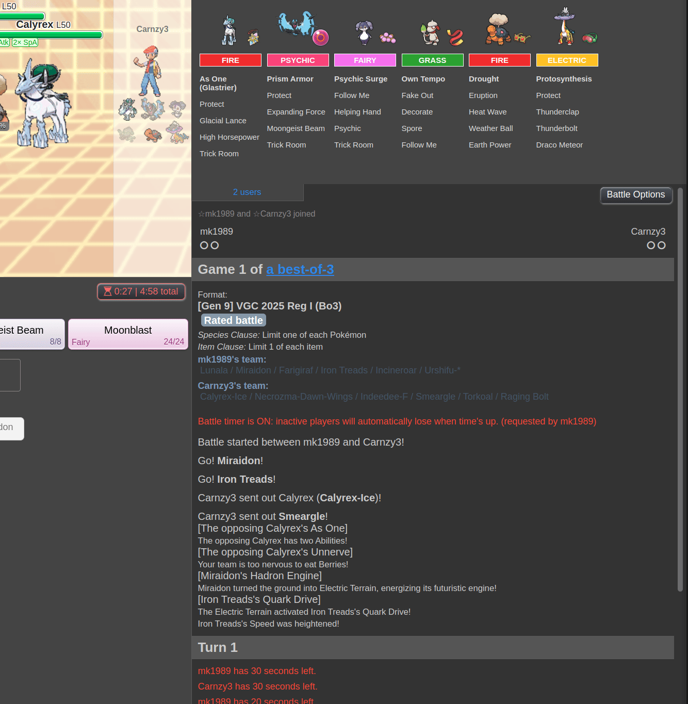
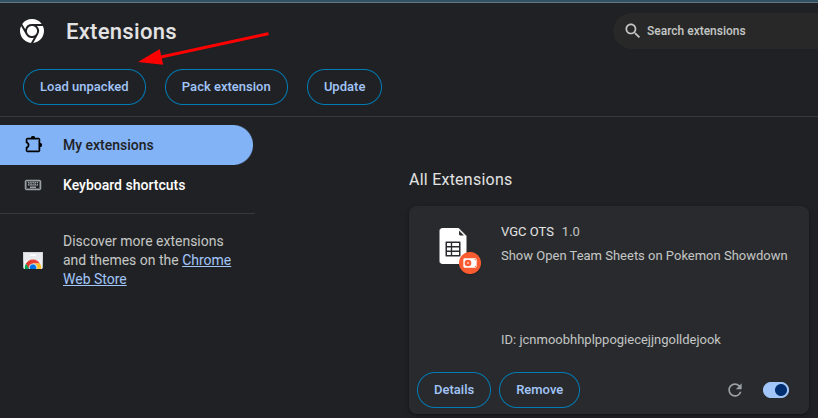

# vgc-ots

This extension is a fork of [OpenTeamsheetGraphic](https://github.com/RobinsonCzajkowski/OpenTeamsheetGraphic), an excellent idea by @RobinsonCzajkowski.

The main purpose of this fork is to display the Open Team Sheet above the chat log in a fixed manner, making the OTS panel constantly visible.



This version also features several differences from the original:

- The code has been rewritten to improve maintainability.
- Visual improvements have been implemented.
- All sprites are now working.
- The original OTS display is replaced by this extension.

## Development

To work locally in this project you'll using basically Html, CSS and Javascript. 

- Clone the project

- Install the dependencies

```
npm install
```

- After to do your changes, run the build command:

```
npm run build
```

- And the tests

```
npm test
```

- So make upload from the dist folder in Chrome extension page



- Acess [Pokémon Showdown] and start a battle